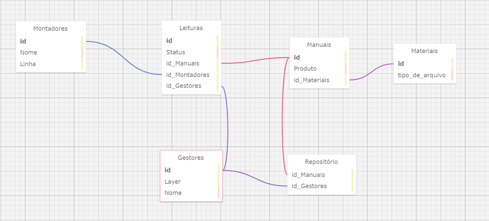

# Modelagem do Banco de Dados
### Por Tiago Victor Ramos dos Santos  
### Ateliê: 13  

## Descrição do projeto

&nbsp;&nbsp;&nbsp;&nbsp; A criação deste Banco de Dados (BdD) se dá pela criação do Dell Aware, uma aplicação intranet desenvolvida para a Dell. Nela, dispõe-se materiais de estudo, conhecidos como manuais, para os operadores/montadores. Os responsáveis por organizar o funcionamento e direcionamento dos estudos destes manuais serão os gestores. Com isso, tem-se um panorama geral do que se trata o projeto.

## Modelo Relacional do Banco de Dados

&nbsp;&nbsp;&nbsp;&nbsp; Nesta atividade recomnendou-se que a modelagem relacional fosse feita pelo SQL Designer, uma plataforma web com uma abordagem simplificada para o desenvolvimento de tabelas de bancos de dados, facilitando a visualização da relação de cada componente dentro de um BdD. 

&nbsp;&nbsp;&nbsp;&nbsp; Nesse sentido, apresenta-se na tabela a baixo o resultado de um trabalho de 1 hora para o desenvolvimento básico das relações entre as diferentes seções de dados que compõem o banco. 

     Figura 1 
    
     Material produzido pelo autor (2024) 

&nbsp;&nbsp;&nbsp;&nbsp; Fica exposto na imagem as relações de cada tabela, conectadas por chaves estrangeiras. Entretanto, cabe ao autor explicar o motivo da criação de cada tabela. Portanto, segue a explicação da criação das relações e da abordagem adotada.

### Tabelas, motivos de sua criação.

&nbsp;&nbsp;&nbsp;&nbsp; É comum que, ao desconhecer a proposta do projeto, as tabelas e suas relações pareçam não fazer sentido. Todavia, cada tabela representa algo muito específico e importante para a aplicação.

&nbsp;&nbsp;&nbsp;&nbsp; Na tabela dos montadores, o usuário principal da aplicação, encontra-se o seu ID, uma primary key usada para identificar cada usuário como recipiente de dados específicos. Nome e Linha são informações que auxiliam na identificação do usuário na parte de visualização e organização das tabelas. 

&nbsp;&nbsp;&nbsp;&nbsp; Um pouco a baixo, os gestores são organizados em sua tabela também. Uma adição que pode fazer diferença para o projeto é a layer de atuação de cada gestor, dado que as layers comandam as layers de baixo, sendo o gestor de layer 1 o nível mais baixo. 

&nbsp;&nbsp;&nbsp;&nbsp; Há, também, a tabela de manuais, a qual organiza os materiais de estudo relacionados a um mesmo produto. Estes manuais estão dentro da tabela Repositório, o qual organiza cada um dos manuais. 

&nbsp;&nbsp;&nbsp;&nbsp; Um detalhe da tabela Repositório é a sua relação com os Gestores, os quais têm acesso a ferramentas para modificar manuais dentro do repositório, adicionar e remover. 

&nbsp;&nbsp;&nbsp;&nbsp; Por último e, definitivamente, a mais importante tabela: Leituras. Ela é responsável por associar determinados manuais a montadores específicos. Ou seja, ela é quem faz toda a aplicação funcionar.

&nbsp;&nbsp;&nbsp;&nbsp; Nesta seção explicou-se a criação das tabelas, abaixo o autor segue a explicação da relação das tabelas por meio das chaves estrangeiras.

### Explicando o relacionamento entre as tabelas

&nbsp;&nbsp;&nbsp;&nbsp; Conhecendo cada tabela individualmente já é possível imaginar as conexões entre elas. Este tópico espera, agora, descrever claramente como cada uma se relaciona no modelo.

&nbsp;&nbsp;&nbsp;&nbsp; Seguindo uma ordem de fluxo de informação, é relevante iniciar a leitura pela tabela Gestores. Esta está conectada com a tabela repositório em uma relação de Muitos Gestores para um Repositório (N - 1). Sendo assim, diferentes gestores terão acesso a um único repositório que é compartilhado.

&nbsp;&nbsp;&nbsp;&nbsp; O repositório, em sequência, também recebe a chava estrangeira <i>id_manuais</i>, que puxa as informações da tabela Manuais. Ou seja, os manuais são adicionados no repositório a partir dessa chave. Essa relação é de 1 para N, dado que apenas um repositório existe e ele armazena todos os manuais.

&nbsp;&nbsp;&nbsp;&nbsp; Ao olhar para a tabela Manuais, vê-se que ela recebe a chave estrangeira <i>materiais</i>, a qual associa os diferentes tipos de materiais disponíveis no ecossistema da Dell a um manual específico. Nesse caso, a relação é de Muitos para Muitos (N - N), visto que diferentes manuais podem ter um mesmo material.

&nbsp;&nbsp;&nbsp;&nbsp; Olhando para o outro lado do modelo, a tabela Montadores se destaca. Sua conexão é dada a Leituras, uma tabela responsável por associar os Gestores, os manuais e os Montadores, permitindo que a função de delegar e a coleta de dados de leitura seja feita. Essa tabela, então, tem a característica especial de ter uma cardinalidade terciária, ou seja, se conectar com três tabelas ao mesmo tempo. Sua relação funciona, então, sempre de 1 para 1, dado que a delegação de cada manual é feita especificamente por 1 gestor e para 1 montador. 

## Conclusão

&nbsp;&nbsp;&nbsp;&nbsp; O modelo relacional de banco de dados foi um desafio, mas adicionou muito ao repertório e facilitou, na medida do possível, o entendimento dos componentes do banco de dados. 

&nbsp;&nbsp;&nbsp;&nbsp; Espera-se que, ao terminar a leitura, tenham sido esclarecidas as escolhas e que o entendimento das relações dentro do banco de dados tenha ficado claro. 
